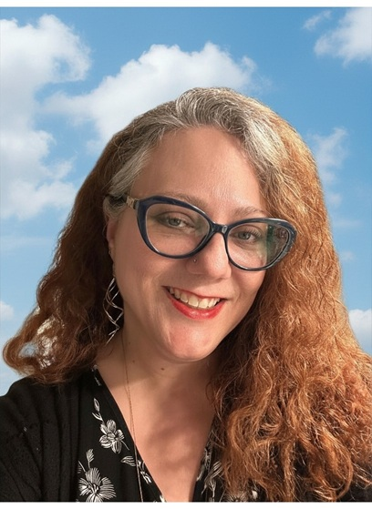

# Amanda Hoaglen
### *Leader, Writer, and Educator*

## About Me 

Greetings! I'm Professor Amanda Hoaglen, but you can call me Professor H. Thank you for visiting my webpage. Please view my curriculum vitea, portfolio of writing samples, and links to organizations that I work with or support.

## My Course Objectives and Learning Centered Statement

By providing you with an abundance of resources, context, and information, my students' critical thinking abilities and communication skills will vastly expand. I want my students to become informed and educated citizens. I want them to experience enlightenment.

## Academic Background

Currently a doctorate student at UCF in the Texts and Technology program, I strive to integrate digital humanities and play pedagogy into my classroom. I earned my Bachelor of Arts in Humanities and Master of Liberal Studies at Rollins College. To further my content knowledge, I completed a Masters of Arts degree in English Literature at the University of West Florida in 2023.

## Teaching Statement
I consider myself a educator for emerging adult learners. As a humanities and English composition instructor, as well as writing center supervisor at my campus. I believe that kindness, experiential learning, and coaching students through the writing process remain essential to the learning process. 

## Research Interests
Being a scholar of interdisciplinary humanities, my interests are ecclectic and include poetry, Athenian philosophy, art history, critical media and women's studies, environment advocacy, and social justice pedagogy. 

Additionally, I want to investigate play and pedagogy during my time in the Texts and Technology doctorate program at UCF.
- The use of role-playing games as a means to facilitate course content to college students.
- In-person and digital role-playing games to nurture active learning in my classroom.
- Alternative teaching methods and texts that encourage student engagement.

At this point in my career, my goal is to expand my teaching portfolio by teaching upper-level English courses at UCF, complete my doctorate at UCF, and publish two manuscripts of poetry. I look forward to sharing my passion for learning, the humanities, and writing with you.

Cheers,

Professor H.

## Navigation

- [Curriculum Vitae](cv.md)

- [Affiliations](socialmedia.md)

- [Research / Projects](projects.md)

- [Teaching](teaching.md)
